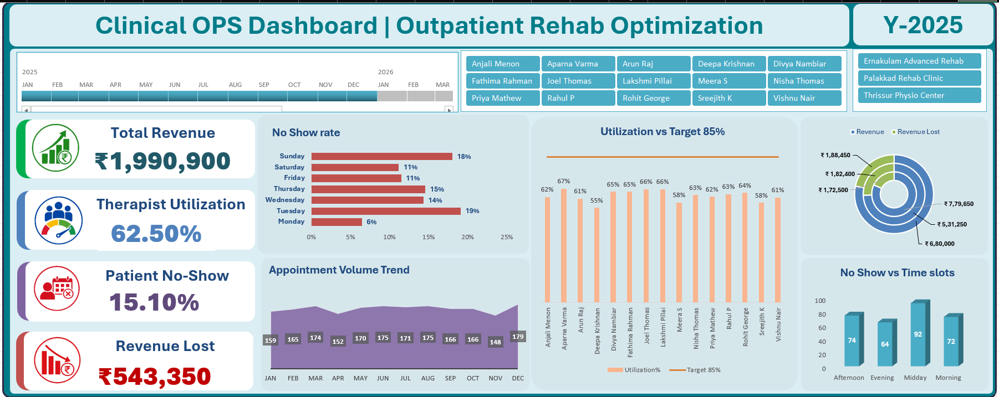

# Clinical Ops Dashboard | Outpatient Rehab Optimization

An Excel-based operational analytics dashboard built to identify revenue leakage, 
therapist underutilization, and patient no-show patterns in an outpatient 
physiotherapy/rehab clinic setting.

## Business Problem
Outpatient rehab clinics lose significant revenue to two under-tracked issues: 
therapist idle time (utilization below target) and patient no-shows clustered 
at specific days/time slots. This dashboard surfaces both, using metrics a 
clinic operations or revenue-cycle team can act on directly.

## Key Insights Delivered
- Reduced blind spots on revenue loss by quantifying ₹543,350 in lost revenue 
  against ₹1,990,900 in total revenue (15.10% overall no-show rate).
- Identified a 23-point utilization gap (62.5% actual vs. 85% target) across 
  15 therapists, with individual-level breakdown to flag specific underutilized staff.
- Surfaced no-show concentration on Tuesdays (19%) and Sundays (18%) vs. a 6% 
  low on Mondays, enabling targeted scheduling fixes.
- Broke down revenue lost by location across 3 clinic branches (Ernakulam, 
  Palakkad, Thrissur), supporting branch-level accountability.

## Tools & Techniques
Excel · Pivot Tables · Pivot Charts · VLOOKUP/XLOOKUP · Power Query · 
Conditional Formatting · KPI Card Design · Dashboard/Report Design · 
Healthcare Operations Analytics

## Dashboard Preview

## About This Project
Built by a former physiotherapist turned Business Analyst, applying 11+ years 
of direct clinical operations experience to design KPIs that reflect what 
actually drives rehab clinic profitability and staff efficiency — not just 
generic BI metrics.
